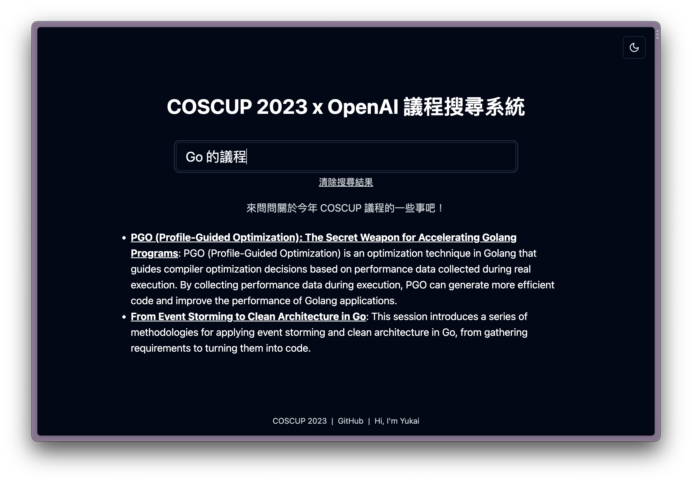

# Coscup x OpenAI 議程搜尋系統

這是今年(2023) Coscup 的議程搜尋系統，結合了 OpenAI 的 Embedding API、Chat Completion API，Supabase 的 pgvector。

原本是要拿來投今年的閃電講，不過沒有抽到，就不用做簡報了 XD

那大家就直接看扣看 Demo 吧

## 關於實作

- 丟 COSCUP 的 [session.json](https://coscup.org/2023/json/session.json) 給 Code Intepreter 分析，產生 Database SQL Schema，以及把 JSON 轉成 `.sql`，可以直接匯入資料庫的程式 (看 [session-data] 資料夾)
- 然後照著 Supabase 這篇文 [Storing OpenAI embeddings in Postgres with pgvector](https://supabase.com/blog/openai-embeddings-postgres-vector) 直接改
- 本來要用 Supabase Functions 來弄，但後來因為 Timeout 問題，以及前端也需要點魔法，所以就搬到了 Vercel
- 前端用 Shadcn UI/Tailwind/Next.js

## 感想

- 其實直接回傳 Embedding 的結果就好了，但因為
- 絕大多數的實作方式

## License

MIT

